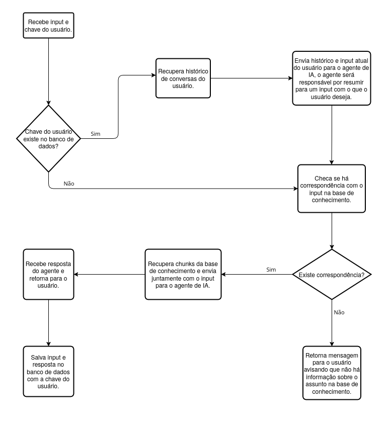

# Chatbot - Monitoria de Computação Gráfica

Esse projeto tem como objetivo desenvolver um chatbot para auxiliar na disciplina de Computação Gráfica, utilizando a abordagem de RAG (Retrieval Augmented Generation). O sistema utiliza materiais desenvolvidos pela professora e monitores, juntamente com livros de referência. O intuito é que o chatbot seja capaz de fornecer respostas precisas, contextualizadas e alinhadas ao conteúdo ministrado na sala de aula.

## Status Atual
Em desenvolvimento.

## Tecnologias Utilizadas
**Python**: Linguagem de programação de alto nível, interpretada, multiparadigma, que suporta os estilos imperativo, orientado a objetos e funcional. Possui tipagem dinâmica e forte, sendo amplamente utilizada no desenvolvimento de aplicações devido à sua simplicidade, legibilidade e vasta disponibilidade de bibliotecas.

**Langchain**: Framework de código aberto voltado ao desenvolvimento de aplicações baseadas em Large Language Models (LLMs). Oferece um conjunto abrangente de ferramentas que facilitam a orquestração de modelos, gerenciamento de contexto, integração com bases de conhecimento e implementação de fluxos como RAG.

**Redis**: Sistema de banco de dados de código aberto orientado a estruturas de dados do tipo chave-valor, amplamente reconhecido por sua alta performance e baixa latência. Sua simplicidade de uso e rapidez o torna adequado para armazenamento temporário, cache e operações que exigem acesso eficiente aos dados.

**GPT-4o Mini**: Modelo de inteligência artificial desenvolvido pela OpenAI, projetado para ser mais rápido e econômico em comparação a modelos maiores da mesma família. Indicado para aplicações que demandam boa capacidade de compreensão de linguagem natural, mas que não exigem raciocínio extremamente complexo, sendo especialmente adequado para o uso com agente baseados em LLMs.

**Text-Embedding-3-Small**: Modelo de geração de embeddings de texto desenvolvido pela OpenAI, responsável por transformar textos em vetores numéricos que representam seu significado semântico. Esses vetores são fundamentais para a implementação de sistemas RAG, permitindo a realização de buscas semânticas eficientes e a recuperação de informações relevantes a partir de uma base de conhecimento.
## Fluxograma

    

